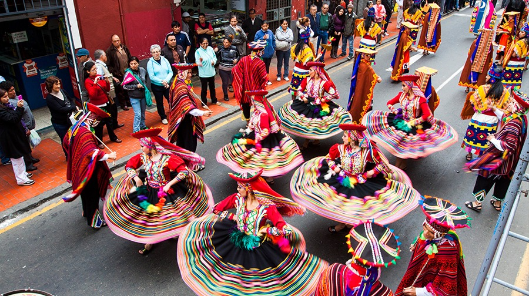

# Tusuy Perú

## Índice

* [1. Introducción](#1-introducción)
* [2. Inicio del proyecto](#2-inicio-del-proyecto)
* [3. Historias de usuario ](#3-historias-de-usuario)
* [4. Modo de uso](#4-modo-de-uso)
* [5. Ejemplos de código](#5-ejemplos-de-código)
* [6. Modelo responsivo](#6-modelo-responsivo)
* [7. Fuentes](#7-fuentes)

## **1. Introducción**

<p align="justify">Sabemos que las redes sociales vinieron para quedarse, cada día que pasa más usuarios se van uniendo para poder interactuar con sus contactos o con personas que no conocen, ya sean para compartir noticias, memes o algún tema en común. Es por ello que comparto este proyecto simple de simulación de una red social donde podrás publicar, editar y eliminar un post acerca de danzas folklóricas peruanas teniendo diferentes vistas usando el SPA(Single Pages Application).</p>

<b>¿Por qué Tusuy?</b>

Tusuy es una palabra quechua que significa "Danzas" y Perú porque los bailes típicos que se conversará, tienen origen peruano. Mediante una encuesta a diferentes personas, en las que daba a elegir algunos otro nombres más, salió ganador esta frase. ♥

<p align="center"></p>
<p align="center"><i>Imagen extraída de peru.info</i></p>


## **2. Inicio del proyecto**

<p align="justify">Tuve una idea de cómo podría iniciar la página y al comienzo consideré que podría ser a través de login pero luego consideré mejor idea que podía implementar una bienvenida al usuario dándole a entender de qué trataba la página con un botón de "Únete" por si el usuario tenía curiosidad de qué más seguía y lo plasmé en el prototipo de alta fidelidad. A continuación les comparto ambos prototipos realizados por mi:
<p align="center"></p>
<p align="center"><i>Prototipo de baja fidelidad</i></p>
<p align="center"></p>
<p align="center"><i>Prototipo de alta fidelidad</i></p>

## **3. Historias de usuario**

<p align="justify">A través de una encuesta, aparte de consultar qué nombre sonaría mejor a la red social, se consultó otras cosas más como de qué es lo que querían los usuarios finales ver en la página web. De manera ordenada se ha ido cumpliendo las historias de usuario para hacer más "amigable" las vistas realizadas y que pueda interactuarse sin mayor dificultad. 
Mientras se iba terminando una vista, se consultaba con otras personas para tener una retroalimentación y poder emplearla tanto en la codificación como en el diseño. </p>
    
<p align="center"></p>


## **4. Modo de uso**

### **4.1 Página de inicio** <a href="https://i.ibb.co/QMpVhJG/view1.png"></a>
<p alin="justify">Abriendo el link te mostrará una página que contiene un vídeo con las danzas típicas peruanas resaltando su variedad y el nombre del proyecto juntamente con la referencia del mismo, si deseas unirte, podrás observar un botón llamando "Únete" donde te invitamos a unirte a nuestra comunidad. </p>
<br>

### **4.2 Página de 'Login'** <a href="https://i.ibb.co/cDTdCkD/view2.png"></a>
<p alin="justify">A continuación aparecerá la ventana de login donde podrás colocar tanto el correo electrónico como la contraseña con la que te registraste y al dar click al botón "Loguéate" podrás entrar a tu muro pero si no tienes cuenta registrada, lo podrás hacer mediante el enlace "Crear cuenta" o si te olvidaste la contraseña, podrás recuperar el acceso a la página accediendo a la ventana "Olvidé contraseña". También podrás loguearte desde Gmail o Facebook.</p>
<br>

### **4.3 Página de 'Olvíde contraseña'** <a href="https://i.ibb.co/gJ6q7Mc/view3.png"></a>
<p alin="justify">Si te olvidaste la contraseña de tu cuenta creada, puedes recuperarla, solo con colocar el correo registrado te llegará un mensaje de confirmación a tu bandeja, por lo que bastará que hagas click a ese enlace y escribas una nueva contraseña</p>
<br>

### **4.4 Página de 'Crear cuenta'** <a href="https://i.ibb.co/BsSspY5/view4.png"></a>
<p alin="justify">Puedes crear una cuenta, solo ingresa un correo electrónico válido y una contraseña entre 6 a 12 caracteres que abarquen números, letras y caracteres especiales. Debes volver a confirmar en el recuadro de texto siguiente para saber si recuerdas la contraseña anteriormente ingresada, de modo que no se te olvide. </p>
<br>

### **4.5 Página de 'Muro'** <a href="https://i.ibb.co/WfbnLdq/view5.png"></a>
<p alin="justify">Esto sería el muro principal, donde si solo estás registrado en la base de datos, podrás acceder, sino te mostrará un mensaje invitándote a unirte a la red social de Tusuy Perú. Aquí podrás publicar, editar, eliminar los posts que hayas comentado, aun faltan funcionalidades como los likes y agregar imágenes pero como lo escribí anteriormente es una simulación para ver el funcionamiento de una red social y sobre todo para aprender el manejo de la misma, poco a poco estaré implementando más funcionalidades.</p>
<br>

## **5. Ejemplos de código**
Para mejor entendimiento de la codificación, usé los *"templates strings"* o plantillas laterales en español, de modo que me ayudaran con la estructura de las páginas y me permitieran la interpolación de expresiones pero también puede usarse el método "createElement()" para crear elementos HTML en JavaScript.
```js
//Estamos indicando que le vamos a dar una clase al nodo 'form' llamada 'form_info'
 const divForm = document.createElement('form');
 divForm.classList.add('form_info');
```
```js
//Podemos darle el nombre 'form_info' al nodo creado pero con el atributo 'id' 
 const divForm = document.createElement('form');
 divForm.setAttributte('form_info', 'id');
```

## 6. Modelo responsivo

<p alin="justify">Debido al avance de la tecnología y que casi el 89% de los usuarios a los que se les consultó sobre qué dispositivo utilizaban más, concordaron en que es el Smartphone es su compañero ideal para la interacción en páginas web, se hizo que el proyecto tenga <i>responsive model</i> por lo que es adaptable a cualquier pantalla ya sea móviles o tablets y también computadoras de mesa o laptops.</p>
<p align="center"></p>
<p align="center"></p>

## 7. Fuentes
Vídeo: PromPerú </ps>
Iconos: FontAwesome.com / Flaticon.es
